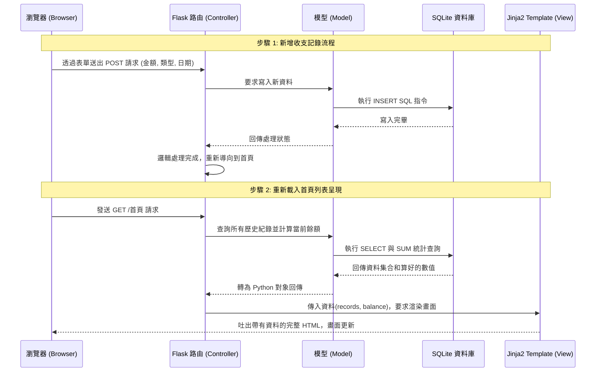

# 系統架構設計 (Architecture)：個人記帳簿

這份文件根據 PRD 的需求，說明「個人記帳簿」系統的技術選型、資料夾結構與元件之間的運作關係，作為後續開發與擴充的依據。

## 1. 技術架構說明

為了兼具快速開發、易用性與輕量化，本專案採用典型的 MVC（Model-View-Controller）模式並使用不分離的網頁應用架構：

- **後端框架：Python + Flask**
  - **原因**：Flask 是一套高彈性的微框架，非常適合開發輕便型的個人應用。它結構簡單，使我們能專注在核心的記帳與統計邏輯上。
- **模板引擎：Jinja2 (View)**
  - **原因**：Flask 原生支援的引擎。它可以直接將後端運算的資料（所有收支紀錄、總餘額）動態插入到 HTML 中進行渲染。不走前後端分離架構的好處是可省去設計 API 及撰寫大量非同步前端程式碼的成本。
- **資料庫：SQLite (Model)**
  - **原因**：輕量級且免安裝獨立伺服器的關聯式資料庫。因為需求是要建立個人記帳簿，單機且方便攜帶拷貝的檔案庫（透過 builtin `sqlite3` 或 `SQLAlchemy`）是最佳方案。

### MVC 職責分配
- **Controller（路由 / Flask Routes）**：擔任中間人，負責接收瀏覽器傳來的請求（如表單送出或切換網頁），呼叫對應的 Model 處理數據，然後指定 Jinja2 Template 去渲染結果。
- **Model（模型 / 資料庫操作）**：封裝所有商業邏輯與對 SQLite 資料庫的存取（增減收支、統計加總與金額計算）。
- **View（視圖 / Jinja2）**：負責畫面排版呈現。將 Controller 傳遞下來的資料轉換為帶有表格或選單的 HTML 給開發者。

## 2. 專案資料夾結構

整個專案會採用以下目錄結構來分離關注點：

```text
expense_tracker/
├── app/                  ← 應用程式的主目錄
│   ├── __init__.py       ← 初始化 Flask APP 並註冊路由與資料庫
│   ├── models/           ← 資料庫模型 (Model)
│   │   └── record.py     ← 處理單筆收支紀錄邏輯的函式與類別
│   ├── routes/           ← 控制器與路由定義 (Controller)
│   │   └── home.py       ← 處理首頁（呈現列表與統計）的請求
│   │   └── record.py     ← 處理新增/刪除專門動作的請求
│   ├── templates/        ← HTML 視圖檔案 (View / Jinja2)
│   │   ├── base.html     ← 通用的共用佈局框架 (選單、基礎資源)
│   │   └── index.html    ← 記帳簿的主頁 (顯示收支明細與餘額)
│   └── static/           ← 前端靜態資源
│       ├── css/
│       │   └── style.css ← 系統外觀樣式
│       └── js/
│           └── script.js ← 前端用 js（如：刪除紀錄時的彈出確認）
├── instance/
│   └── database.db       ← SQLite 資料庫儲存點 (通常不會進版控)
├── docs/                 ← 專案文件
│   ├── PRD.md            ← 產品需求文件
│   └── ARCHITECTURE.md   ← 系統架構設計文件 (本文件)
├── app.py                ← 網站的啟動入口腳本
└── requirements.txt      ← 專案相依性 Python 套件
```

## 3. 元件關係圖

以下是系統處理收支新增以及載入記錄清單時，各元件如何互相呼叫的流程：



## 4. 關鍵設計決策

1. **伺服器渲染 (SSR) 取代 API 架構**
   - **問題背景**：開發個人輕量系統的目標是快速完成 MVP。
   - **決策**：不採用前端框架（如 React / Vue），使用 Jinja2 作為視圖能省去跨網域存取 (CORS) 與 API 設計上的繁瑣細節。
   
2. **採用 Flask Blueprint 進行 Controller 切分**
   - **問題背景**：如果所有功能（新增、刪除、清單顯示）全寫在 `app.py` 中，會導致檔案肥大且難以維護。
   - **決策**：採用 Flask 的 `Blueprint` 功能來將路由拆分到 `routes/` 目錄中，能讓 `home` 模組和處理資料操作的 `record` 模組職責清晰分離。

3. **統一使用安全且參數化的資料存取方法**
   - **問題背景**：直接把字串拼入 SQL 中容易造成 SQL Injection（SQL 注入攻擊）。
   - **決策**：無論是依靠 `sqlite3` 的 `?` 參數化查詢，還是引入輕量的 SQLAlchemy 作為 ORM，皆規定寫入和查詢不得使用原生字串拼接。同時仰賴 Jinja2 本身的跳脫機制處理 XSS（跨站指令碼）防護。

4. **抽離 SQLite 實體庫檔案至獨立資料夾**
   - **問題背景**：將 DB 存放在專案根目錄或是程式碼旁邊，常導致不小心將資料庫提交至 Git 中，會洩漏個人的真實財務數據。
   - **決策**：Flask 內建 `instance/` 資料夾概念專門存放本地特定的數據和配置，將 `database.db` 存放於此並在 `.gitignore` 忽略該資料夾，確保安全與環境整潔。
