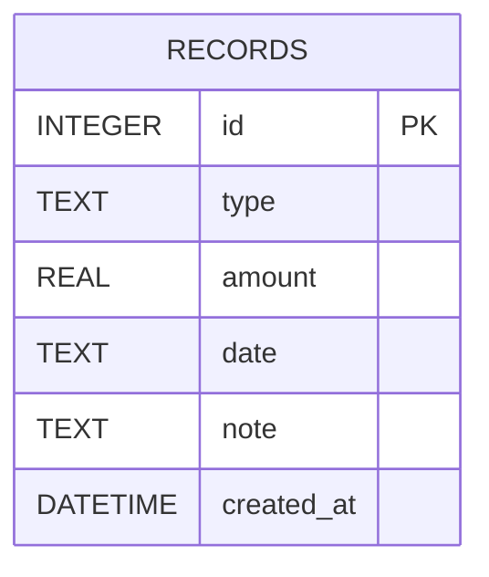

# 資料庫設計文件 (DB Design)

本文件依據 PRD 與系統架構，定立個人記帳簿系統的資料庫結構。

## 1. ER 圖

## 2. 資料表詳細說明

### 資料表：`records` (收支記錄表)
| 欄位名稱    | 資料型別  | 屬性         | 說明                                                               |
| ----------- | --------- | ------------ | ------------------------------------------------------------------ |
| `id`        | INTEGER   | PK, 遞增自動 | 系統唯一的紀錄編號 (Primary Key)                                   |
| `type`      | TEXT      | NOT NULL     | 收支類型，僅允許 `'income'` (收入) 或 `'expense'` (支出)           |
| `amount`    | REAL      | NOT NULL     | 金額，採用 REAL 以支援小數點（整數亦可順利儲存）                   |
| `date`      | TEXT      | NOT NULL     | 該筆收支發生的日期，使用 ISO 8601 YYYY-MM-DD 格式                  |
| `note`      | TEXT      |              | 備註說明，此為選填項目                                             |
| `created_at`| DATETIME  | NOT NULL     | 系統建立此紀錄的時間，預設帶入 `CURRENT_TIMESTAMP`                    |

## 3. SQL 建表語法
請參考專案中的 `database/schema.sql` 檔案。

## 4. Python Model 程式碼
請參考專案中的 `app/models/record.py` 檔案。使用了原生的 `sqlite3` 模組，封裝對 `instance/database.db` 的 CRUD 操作，並包含取得餘額的擴展功能。
