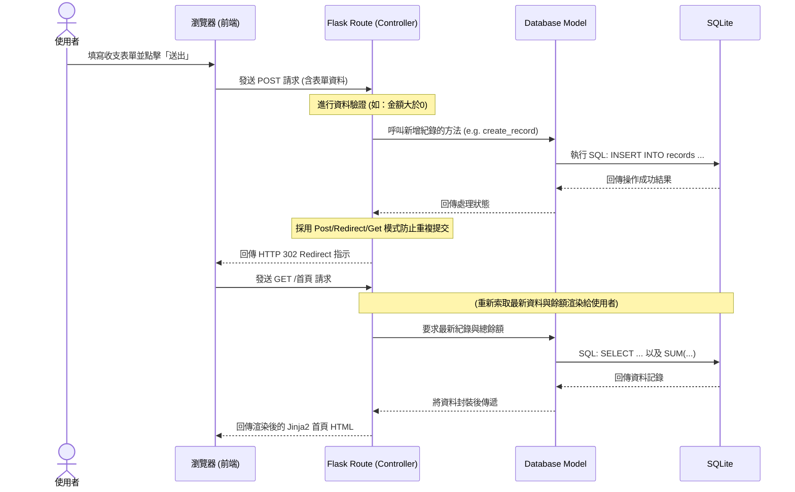

# 流程圖設計 (Flowchart)：個人記帳簿

這份文件根據產品需求文件 (PRD) 與系統架構文件 (ARCHITECTURE) 的規劃，將使用者的操作歷程與系統內部的資料流動視覺化，幫助團隊對齊開發邏輯。

## 1. 使用者流程圖 (User Flow)

這張圖展示了使用者進入系統後，可以進行的各種操作路徑：

```mermaid
flowchart LR
    A([使用者開啟記帳簿]) --> B[首頁<br/>(顯示目前餘額與所有收支清單)]
    B --> C{選擇操作}
    
    %% 新增流程
    C -->|點擊「新增紀錄」| D[填寫收支表單<br/>金額、類型、日期、備註]
    D --> E{驗證資料}
    E -->|資料不齊全/錯誤| D
    E -->|資料正確並送出| F[系統儲存記錄]
    F --> B
    
    %% 刪除流程
    C -->|點擊記錄旁「刪除」| G{系統提示確認刪除？}
    G -->|取消| B
    G -->|確認| H[系統刪除該記錄]
    H --> B
```

## 2. 系統序列圖 (Sequence Diagram)

此序列圖描述了核心功能——「使用者新增一筆收支記錄」時，系統底層個元件之間互相呼叫的順序與資料傳遞方向：



## 3. 功能清單對照表

開發時，我們會將實際的功能端點對應成以下的 URL 路徑與 HTTP 方法規範：

| 功能描述 | URL 路徑 (建議) | HTTP 方法 | Controller / Model 邏輯說明 |
| :--- | :--- | :--- | :--- |
| **首頁 (顯示列表與餘額)** | `/` | `GET` | 透過讀取 DB 取得所有歷史明細，統計正負餘額並利用 Jinja2 渲染畫面。 |
| **新增收支記錄 (送出表單)** | `/record` 或 `/record/create` | `POST` | 解析請求中的 Body 資料，驗證數字與必填項後寫入 SQLite，完成後 `Redirect` 至首頁。 |
| **刪除收支記錄** | `/record/<int:record_id>/delete` | `POST` | 考量 HTML `<form>` 預設不支援 DELETE，使用 POST 並帶上路徑參數 ID 以進行指定刪除。 |
| *(視 UI 設計而定)* <br/>顯示新增表單頁 | `/record/create` | `GET` | 如果 UI 沒有將新增表單做在「首頁」的側邊欄或 Modal 內，此路徑則負責單純顯示輸入表單。 |
